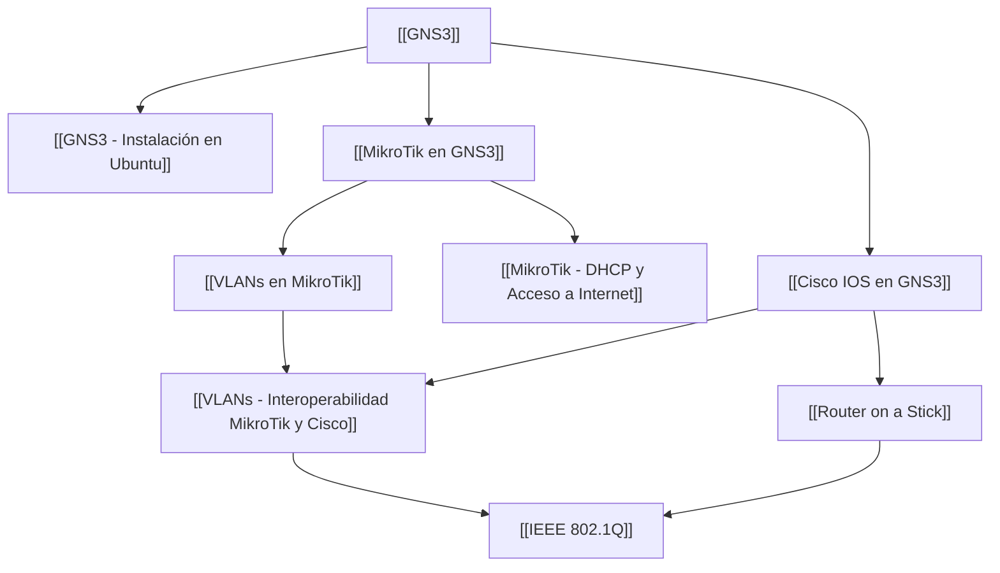

---
categories:
  - "[[Ciber]]"
  - "[[ASIR]]"
tags:
  - networking
  - gns3
  - curso
  - laboratorio
created: 2026-04-23
source: "https://youtube.com/playlist?list=PLwaBKSCQiAAFCU0o_XNhRXfXo3rn3-XQ_"
---
# Curso GNS3 desde Cero

> **Canal:** [kyateyatiende](https://www.youtube.com/@kyateyatiende) — Videotutoriales de configuraciones de redes paso a paso en castellano.

Este curso cubre la instalación, configuración y uso de [[GNS3]] para montar laboratorios de redes con dispositivos [[MikroTik en GNS3|MikroTik]] y [[Cisco IOS en GNS3|Cisco]], incluyendo [[VLANs]], [[DHCP]], [[NAT]] y enrutamiento inter-VLAN.

---

## 📋 Índice de Vídeos

| # | Vídeo | Nota |
|---|-------|------|
| 1 | [How to Install GNS3 on Ubuntu](https://youtu.be/tN29xyAPiAM) | [[GNS3 - Instalación en Ubuntu]] |
| 2 | [How to Install MikroTik on GNS3 (CHR + Winbox)](https://youtu.be/ugTBsWQImUg) | [[MikroTik en GNS3]] |
| 3 | [MikroTik Router Configuration, DHCP and Internet Access](https://youtu.be/X8g2BCC7tq4) | [[MikroTik - DHCP y Acceso a Internet]] |
| 4 | [Cómo Instalar Router y Switch Cisco (IOS)](https://youtu.be/XpfJgg_W2ak) | [[Cisco IOS en GNS3]] |
| 5 | [VLANs en MikroTik \| Tagged, Untagged y Firewall](https://youtu.be/MLUmsa72IA0) | [[VLANs en MikroTik]] |
| 6 | [VLANs entre MikroTik y Cisco \| Trunk, Tagged y Untagged](https://youtu.be/tWl-4_FtQjA) | [[VLANs - Interoperabilidad MikroTik y Cisco]] |
| 7 | [VLANs in Cisco \| Router on a Stick, NAT and Internet Access](https://youtu.be/iHi4avmmCrk) | [[Router on a Stick]] |

---

## 🗺️ Mapa de Conceptos

---

## Notas Relacionadas

- [[GNS3]] — ¿Qué es GNS3? Emulador de redes
- [[VLANs]] — Conceptos generales de VLANs
- [[DTP & VTP]] — Protocolos de trunking (Cisco)
- [[Routing Protocols]] — RIP, OSPF
- [[Switch Interfaces]] — Configuración de interfaces de switch
- [[IEEE 802.1Q]] — Estándar de etiquetado de tramas
